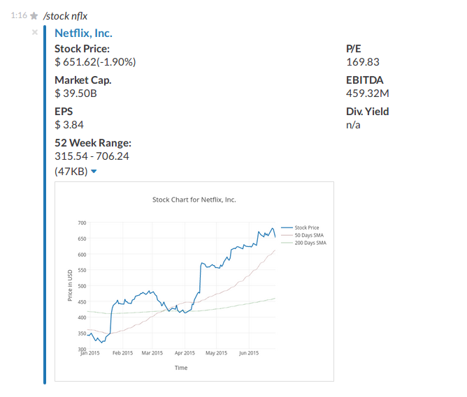

# stockbot
Slack Integration for Displaying Stock Information

## Configuration

A [Slack](https://api.slack.com/) slash-command and an incoming webhook must be configured. Also a [plot.ly](https://plot.ly) account is required for displaying the stock chart.
 

**config.js**
```javascript
var config = {};

config.slackHook = "https://hooks.slack.com/services/personal_hook_url";
config.slackToken= "slack_token";
config.plotlyUser = "plot.ly_username";
config.plotlyToken = "plot.ly_token";
config.port = 4711;

module.exports = config;
```

## Usage

Once up and running
```
npm install
npm start
```

users can display stock information with an appropriate slash command (eg. /stock aapl)

### Example Output




 
